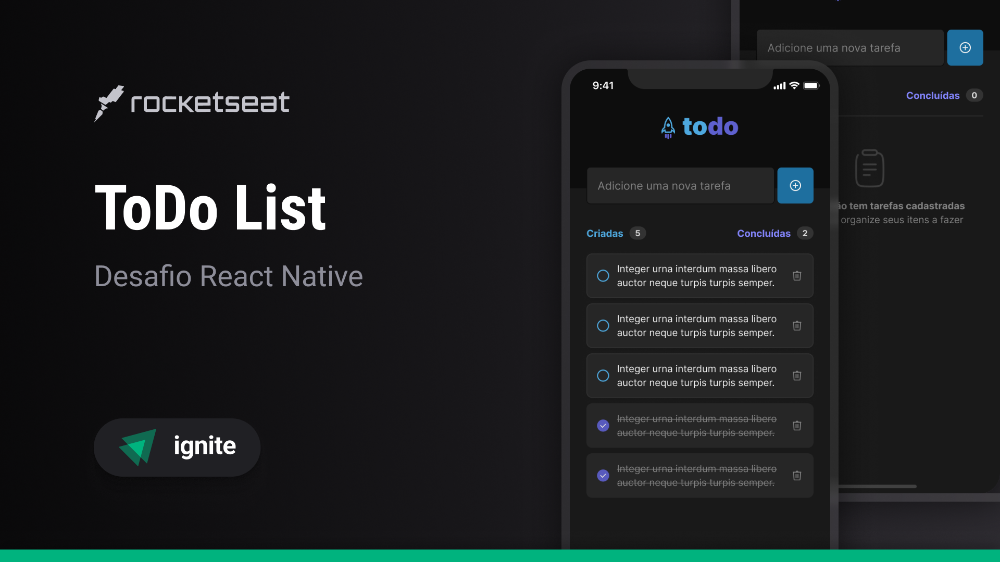

# Gerenciador de Tarefas - Projeto React Native com TypeScript



Este é um projeto de **gestão de tarefas** desenvolvido com **React Native**. O objetivo do aplicativo é permitir que os usuários criem, concluam e excluam tarefas de maneira simples e interativa. O projeto foi desenvolvido como parte do curso da **Rocketseat**.

## Funcionalidades

- **Adicionar Tarefas**: O usuário pode adicionar novas tarefas. Se o campo de entrada estiver vazio, será exibido um alerta solicitando que o usuário insira uma descrição.
- **Concluir Tarefas**: O usuário pode concluir tarefas, o que as move para o final da lista e altera o ícone e o estilo para refletir que a tarefa foi concluída (texto riscado e ícone diferente).
- **Excluir Tarefas**: O usuário pode excluir tarefas a qualquer momento. Isso as remove tanto da lista de tarefas ativas quanto da lista de tarefas concluídas.
- **Contagem de Tarefas**: Exibe a quantidade de tarefas criadas e concluídas na parte superior da tela.
- **Interface Intuitiva**: A interface foi desenhada de forma simples e acessível, garantindo uma boa experiência ao usuário.

## Tecnologias Usadas

- **React Native**: Framework utilizado para o desenvolvimento do aplicativo móvel.
- **TypeScript**: Usado para garantir maior segurança no código e tipagem estática durante o desenvolvimento.


## Como Rodar o Projeto

1. Clone o repositório:
   ```bash
   git clone https://github.com/ericaabxx/toDoList
